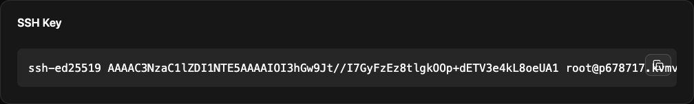

Jakeloud clones repositories on the server. For SSH clone URLs, authorize the public key generated by your Jakeloud instance.

## Copy the public key

Open **Settings → SSH Key** in the dashboard and use the copy button. This is the server's deployment key, separate from the SSH key you use on your laptop.



## Add it to GitHub

Open [GitHub SSH keys](https://github.com/settings/keys), select **New SSH key**, give the key a recognizable title, and paste the public key from Jakeloud. Use a GitHub account that can read the repositories you plan to deploy.

For access limited to one repository, you can instead add the public key under that repository's **Settings → Deploy keys**. Cloning needs read access only.

## Use the SSH clone URL

Copy the repository's SSH URL into the project's **Repository** field:

```text
git@github.com:your-account/your-repository.git
```

Jakeloud creates a fresh shallow clone for each release. Push changes to the repository's default branch before starting a **Full Reboot**.

If cloning fails, confirm that you added the key from the correct instance, that the repository URL is correct, and that the GitHub account or deploy key can read it. The server stores its key pair at `/app/id_rsa` and `/app/id_rsa.pub`; only share the `.pub` file.

Continue to [prepare your application](/guide/application-structure/).
