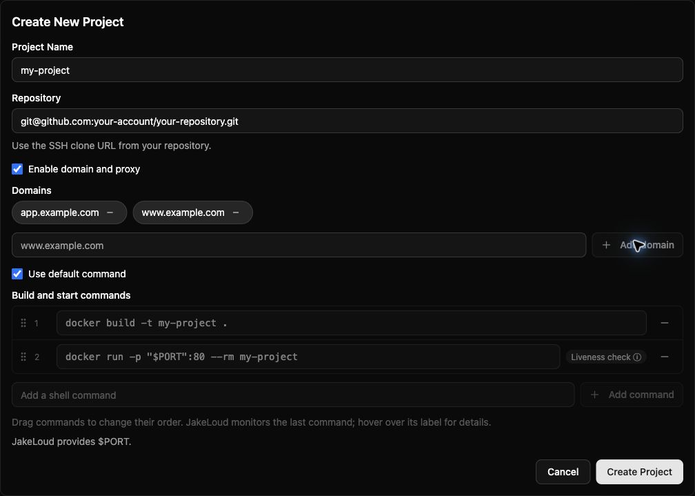
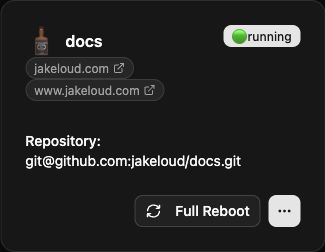

First [connect your repository](/guide/add-ssh-key/) and [prepare its commands](/guide/application-structure/).

## Create a project

Select **Add Project** in the **Projects** tab.

| Field | Value |
| --- | --- |
| Project Name | A unique name starting with a letter or number. Use letters, numbers, underscores, dots, or hyphens. `jakeloud` is reserved. |
| Repository | The Git clone URL, such as `git@github.com:your-account/your-repository.git`. |
| Enable domain and proxy | Check for a website; leave unchecked for a worker. |
| Domains | Enter each hostname and select **Add domain**. Point every hostname's DNS at your server. Use unique hostnames without schemes, paths, or ports. |
| Use default command | Check for Docker build and run steps serving container port 80. |
| Build and start commands | Uncheck the default option to edit, add, remove, or drag command rows. The final command must run in the foreground. |

Select **Create Project** to start deployment. On the project card, select the **…** button to open its details, then **Update status** to fetch logs and runtime information.

Web projects switch traffic automatically after the final command stays alive for five seconds and proxy and certificate setup succeeds. This is a process check; verify that your application actually serves requests. See [releases](/guide/releases/).

## Deploy an update

Push changes to the repository's default branch. In the project view, review **Build and start commands**, then select **Full Reboot**. It clones the repository again and executes those steps as a new release. **Full Reboot** on the project card uses the saved commands.

Use **Update status** to follow progress. A Git push alone does not trigger deployment.

## Edit domains

Open the settings icon beside the domain links or **No domain**. Use **Add domain** to add hostnames or a domain's minus button to remove it, then select **Save and redeploy**. This deploys with the commands currently selected in the project view.

The editor requires at least one domain. To run an existing project without domains, redeploy through the [API](/guide/api/) with `domain: []`.

## Delete a project

Select **Delete Project** and confirm. This stops releases and removes the project directory and Nginx site files. Back up any data in that directory first; external volumes and databases are managed separately.
