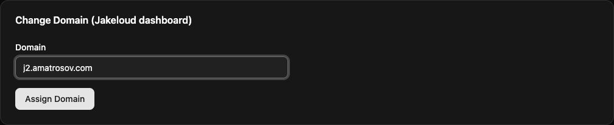

Jakeloud runs as a systemd service on your server. The installer sets up Nginx, Certbot, Git, and an SSH client, then prints a dashboard URL.

## Prepare your server

Use a Debian-based Linux server with systemd, root access, and a public IPv4 address. The upstream project recommends Debian 11. Allow inbound HTTP and HTTPS traffic on ports **80** and **443**, and reserve those ports for Jakeloud's Nginx configuration.

The installer does **not** install Docker or application runtimes. Install Docker before using the default deployment command, or install the runtime required by your custom command. On a Debian server, a basic Docker setup is:

```bash
sudo apt-get update
sudo apt-get install -y docker.io curl
sudo systemctl enable --now docker
sudo docker info
```

Size the server for your applications and their builds; a small runtime can still need substantial memory during a build.

## Install the release binary

Download the `jl` asset from the [release page](https://github.com/jakeloud/jl/releases). The following example uses **v%JAKELOUD_VERSION%**:

```bash
curl -fL https://github.com/jakeloud/jl/releases/download/v%JAKELOUD_VERSION%/jl -o jl
chmod +x jl
sudo ./jl
```

Run these commands in a download directory, outside `/usr/local/bin`. The installer copies the executable to `/usr/local/bin/jl`, creates `/app`, and enables and starts `jakeloud.service`.

The guides follow the current source. If your installed release has different controls, see [building from source](/guide/operations/#build-from-source).

## Open the dashboard

Open the HTTPS URL printed by the installer. On a fresh installation, it has this form:

```text
https://jakeloud.<your-public-ip>.sslip.io
```

Jakeloud creates the proxy and requests a certificate for that hostname. If the page does not load, check DNS, ports 80 and 443, and the [service logs](/guide/operations/#inspect-the-service).

Register your email and password. The first registered user becomes the dashboard owner. Later visits show the login form.

To use your own dashboard hostname, point its DNS record at the server, then open **Settings → Change Domain (Jakeloud dashboard)**, enter the hostname without `https://`, and select **Assign Domain**. The browser redirects to the new HTTPS address.



## Deploy your first project

[Add the server's SSH key](/guide/add-ssh-key/), [prepare your repository](/guide/application-structure/), then [create a project](/guide/create-application/). Once a project exists, you can also [manage it through an agent](/guide/agents/).
