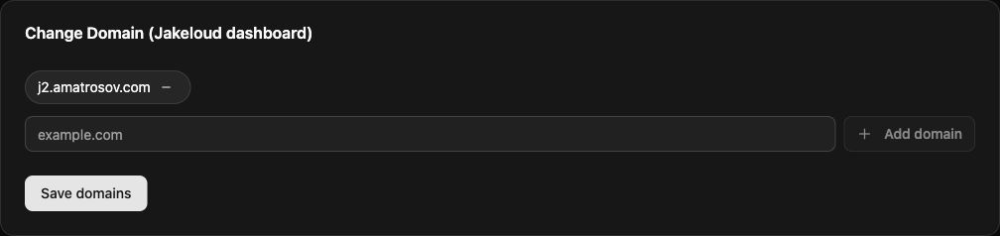

Jakeloud runs as a systemd service on a Debian-based Linux server. The installer sets up Nginx, Certbot, Git, and an SSH client.

## Prepare your server

Use a server with systemd, root access, and a public IPv4 address. Upstream recommends Debian 11. Allow inbound ports **80** and **443** and reserve them for Jakeloud's Nginx configuration.

The published `jl` binary is for **Linux x86-64**. For another architecture, [build from source](/guide/operations/#build-from-source).

Install Docker for the default commands, or the runtime and build tools your custom commands require. The Jakeloud installer does not install them. For Docker on Debian:

```bash
sudo apt-get update
sudo apt-get install -y docker.io curl
sudo systemctl enable --now docker
sudo docker info
```

## Install the release binary

Download **v%JAKELOUD_VERSION%** from the [upstream releases](https://github.com/jakeloud/jl/releases):

```bash
curl -fL https://github.com/jakeloud/jl/releases/download/v%JAKELOUD_VERSION%/jl -o jl
chmod +x jl
sudo ./jl
```

Run from a download directory outside `/usr/local/bin`. The installer copies the executable to `/usr/local/bin/jl`, creates `/app`, and enables and starts `jakeloud.service`.

## Open the dashboard

Open:

```text
https://jakeloud.<your-public-ip>.sslip.io
```

Jakeloud creates the proxy and requests a certificate for that hostname. If it is unavailable, check DNS, inbound ports, and the [service journal](/guide/operations/#inspect-the-service).

Register your email and password. The first account owns the dashboard. Later visits use the login form.

## Set dashboard domains

Point your hostnames at the server. In **Settings → Change Domain (Jakeloud dashboard)**, enter each hostname and select **Add domain**, then **Save domains**. Use hostnames without schemes, paths, or ports. The browser redirects to the first hostname in the list.



Continue to [connect your Git repository](/guide/add-ssh-key/).
