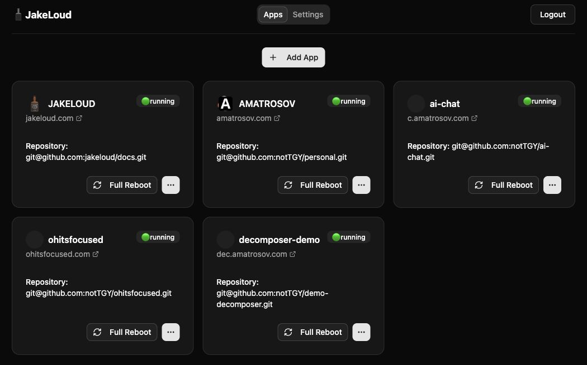

import { Card, CardGrid } from '@astrojs/starlight/components';

Jakeloud is a self-hosted deployment tool with a web dashboard. It clones your Git repository, runs your build and start command, and routes web traffic through Nginx with HTTPS certificates managed by Certbot.

The new [jakeloud/jl](https://github.com/jakeloud/jl) gives you custom commands, numbered releases, and control over when traffic moves to a new version—all on your own server. [Explore what the new Jakeloud offers](/guide/why-jakeloud/).


## Install on your server

On a fresh Debian-based server with systemd and a public IPv4 address, allow ports **80** and **443**, then run these commands from a download directory:

```bash title="Server setup · Docker + Jakeloud v%JAKELOUD_VERSION%"
sudo apt-get update &&
sudo apt-get install -y docker.io curl &&
sudo systemctl enable --now docker &&
curl -fL https://github.com/jakeloud/jl/releases/download/v%JAKELOUD_VERSION%/jl -o jl &&
chmod +x jl &&
sudo ./jl
```

Open the HTTPS address printed by the installer and register your account. See the [installation guide](/guide/) for prerequisites and [maintenance guide](/guide/operations/#update-jakeloud) for updates to an existing server.

## Connect your coding agent

Run this on the computer where your agent runs. The installer lets you choose your agent:

```bash title="Install the Jakeloud skill"
npx skills add jakeloud/skill
```

For a global installation in both Codex and OpenCode:

```bash title="Install globally for Codex and OpenCode"
npx skills add jakeloud/skill -g -a codex -a opencode
```

Restart your agent, then configure the instance URL and credentials in your terminal. See [agent setup](/guide/agents/#configure-your-instance) for the configuration command for your agent.

## Your deployments at a glance



Dashboard captured from a running Jakeloud instance. This deployed version labels the list **Apps** and the create button **Add App**; current source uses **Add Project**. The guides describe the current source's command and release controls.

## Built for your own server

<CardGrid>
  <Card title="Deploy a repository">
    Use the default Docker workflow or supply a command for your own runtime. Jakeloud gives each release its own directory and port.
  </Card>
  <Card title="Control when traffic switches">
    Inspect release logs, confirm that a web app is ready, and switch its domain to the new release. A configurable timeout can switch it automatically.
  </Card>
  <Card title="Run web apps and workers">
    Enable a domain for a public website or leave it off for a background process. Keep your application running in the foreground so Jakeloud can track it.
  </Card>
  <Card title="Understand every release">
    See the assigned port, process ID, candidate or active role, and per-release logs. Optional Telegram notifications report deployment starts and failures.
  </Card>
  <Card title="Keep serving during startup">
    Prepare a web release while the previous process serves traffic. Jakeloud attempts to restore the previous proxy target if a switch fails during proxy or certificate setup.
  </Card>
  <Card title="Work with your coding agent">
    Install the Jakeloud skill to list projects, read status and logs, and request a full reboot from your agent.
  </Card>
</CardGrid>

Start with [installation](/guide/), [deploy your first project](/guide/create-application/), or [set up an agent](/guide/agents/).
