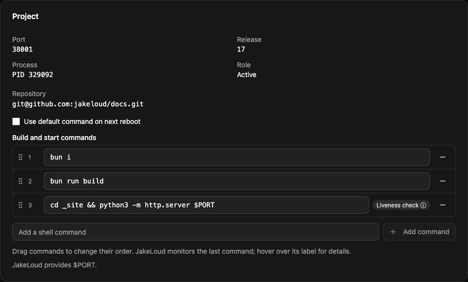

Jakeloud is a self-hosted deployment tool. It clones a Git repository, runs ordered build and start commands, and serves your application through Nginx with HTTPS. Use the web dashboard, [coding-agent skill](/guide/agents/), or [HTTP API](/guide/api/) to operate projects.

Projects can serve several domains or run as workers without a domain. Each deployment has its own checkout, port, process, and log. [Read how releases work](/guide/releases/).

## Install on your server

On a Debian-based server with systemd and a public IPv4 address, allow ports **80** and **443**, then run from a download directory:

```bash title="Docker + Jakeloud v%JAKELOUD_VERSION%"
sudo apt-get update &&
sudo apt-get install -y docker.io curl &&
sudo systemctl enable --now docker &&
curl -fL https://github.com/jakeloud/jl/releases/download/v%JAKELOUD_VERSION%/jl -o jl &&
chmod +x jl &&
sudo ./jl
```

Open `https://jakeloud.<your-public-ip>.sslip.io` and register your account. See [installation](/guide/) for server requirements, then [deploy a project](/guide/create-application/).

## Connect your coding agent

Run on the computer where your agent runs:

```bash
npx skills add jakeloud/skill
```

Restart your agent and [configure the skill](/guide/agents/#configure-your-instance) with your instance URL and account. It can list projects, inspect status and logs, and redeploy saved projects.

## Dashboard


